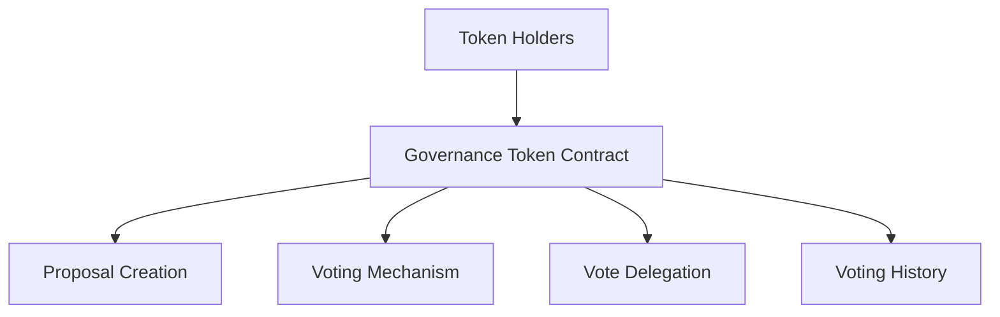

# Wrap Voting: Decentralized Governance Platform

A blockchain-powered governance system enabling transparent, secure, and flexible token-based voting for decentralized organizations.

## Overview

Wrap Voting is a comprehensive governance platform built on the Stacks blockchain that empowers token holders to participate in decision-making processes through a secure, transparent, and programmable voting mechanism.

### Key Features

- Tokenized voting rights
- Flexible proposal creation
- Vote delegation
- Transparent voting history
- Immutable governance records

## Architecture

The Wrap Voting system is designed around a core governance token contract that manages:
- Token minting and distribution
- Proposal creation
- Voting mechanisms
- Delegation of voting power
- Historical vote tracking



## Contract Documentation

### Governance Token Contract

The main contract (`governance-token.clar`) handles all core functionality for the Wrap Voting system.

#### Key Components

1. **Token Management**
   - Token minting
   - Balance tracking
   
2. **Proposal System**
   - Proposal creation
   - Voting
   - Vote delegation
   
3. **Governance Mechanisms**
   - Transparent voting
   - Immutable vote records

## Getting Started

### Prerequisites
- Clarinet
- Stacks wallet
- Access to the Stacks blockchain

### Basic Usage

1. **Mint Governance Tokens**
```clarity
(contract-call? .governance-token mint-tokens 'SP123... u1000)
```

2. **Create a Proposal**
```clarity
(contract-call? .governance-token create-proposal 
    "Upgrade Protocol" 
    "Proposal to upgrade core protocol mechanisms" 
    u100)
```

3. **Vote on a Proposal**
```clarity
(contract-call? .governance-token vote-on-proposal u1 true)
```

## Security Considerations

### Voting Integrity
- Votes are weighted by token balance
- Prevents double voting
- Immutable vote recording

### Token Management
- Controlled token minting
- Transparent balance tracking
- Delegated voting power

## Development

### Testing
1. Clone the repository
2. Install Clarinet
3. Run tests:
```bash
clarinet test
```

### Local Development
1. Start Clarinet console:
```bash
clarinet console
```

## Contributing

Contributions are welcome! Please read our contributing guidelines and code of conduct.

## License

[Add your license information here]